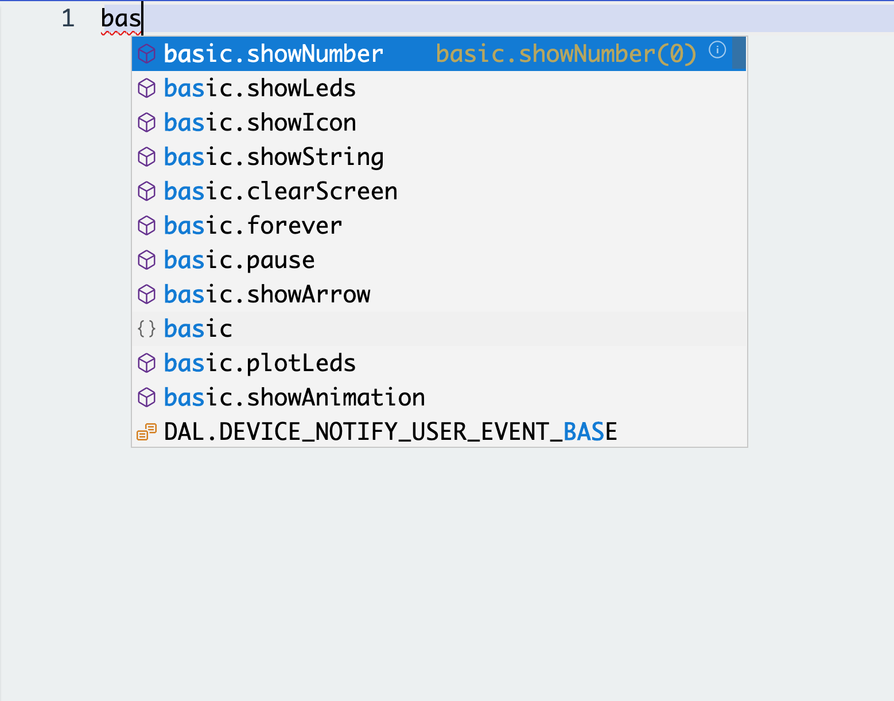
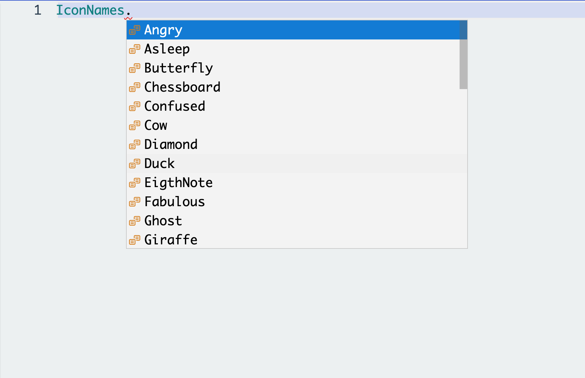
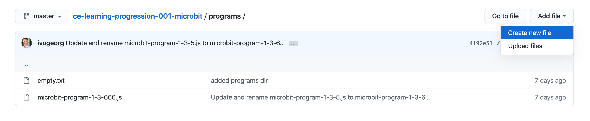
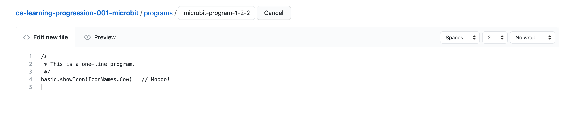
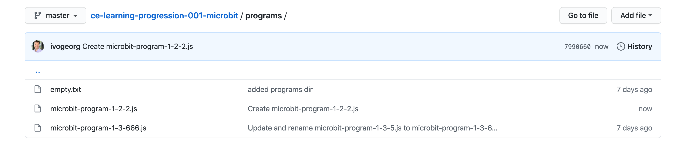
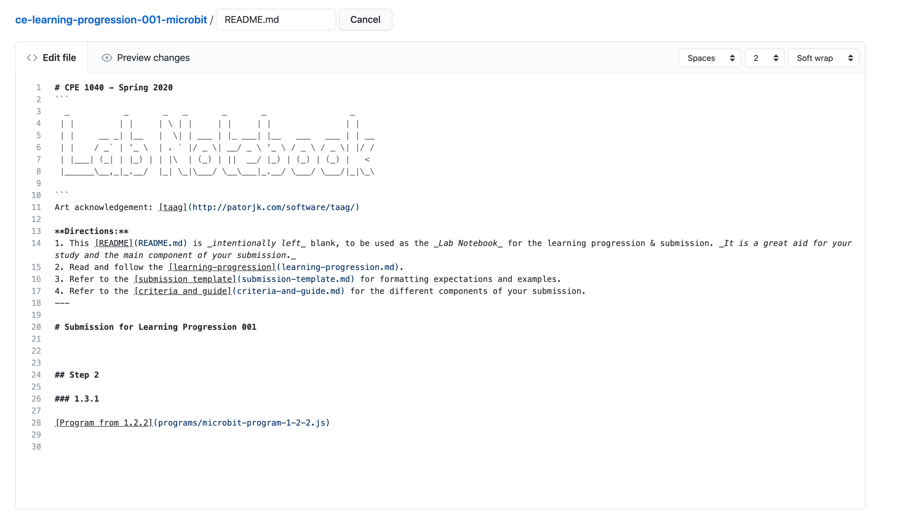
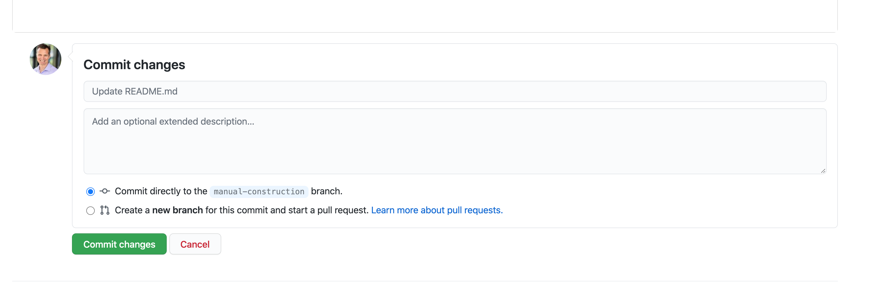
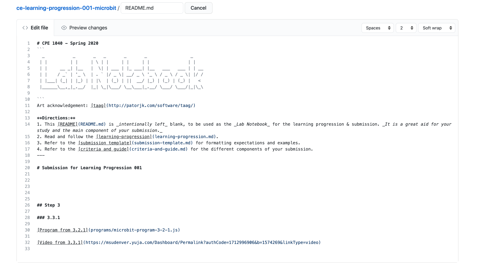

# CPE 1040 - Fall 2020

This is learning progression 001 for the Fall 2020 installment of the course CPE 1040: Introduction to Computer Engineering at MSU Denver.

Table of Contents
=================

* [CPE 1040 \- Fall 2020](#cpe-1040---fall-2020)
* [Table of Contents](#table-of-contents)
  * [Learning Progression 001: micro:bit](#learning-progression-001-microbit)
    * [Step 1: One\-line program](#step-1-one-line-program)
      * [1\. Study](#1-study)
      * [2\. Apply](#2-apply)
      * [3\. Present](#3-present)
    * [Step 2: Comments](#step-2-comments)
      * [1\. Study](#1-study-1)
      * [2\. Apply](#2-apply-1)
      * [3\. Present](#3-present-1)
    * [Step 3: Sequential execution](#step-3-sequential-execution)
      * [1\. Study](#1-study-2)
      * [2\. Apply](#2-apply-2)
      * [3\. Present](#3-present-2)
    * [Step 4: Encapsulation](#step-4-encapsulation)
      * [1\. Study](#1-study-3)
      * [2\. Apply](#2-apply-3)
      * [3\. Present](#3-present-3)
    * [Step 5: Conditionals](#step-5-conditionals)
      * [1\. Study](#1-study-4)
      * [2\. Apply](#2-apply-4)
      * [3\. Present](#3-present-4)
    * [Step 6: Variables and data types](#step-6-variables-and-data-types)
      * [1\. Study](#1-study-5)
      * [2\. Apply](#2-apply-5)
      * [3\. Present](#3-present-5)
    * [Step 7: Loops](#step-7-loops)
      * [1\. Study](#1-study-6)
      * [2\. Apply](#2-apply-6)
      * [3\. Present](#3-present-6)
    * [Step 8: Functions](#step-8-functions)
      * [1\. Study](#1-study-7)
      * [2\. Apply](#2-apply-7)
      * [3\. Present](#3-present-7)
    * [Step 9: Loop function](#step-9-loop-function)
      * [1\. Study](#1-study-8)
      * [2\. Apply](#2-apply-8)
      * [3\. Present](#3-present-8)
    * [Step 10: Writing minimal code](#step-10-writing-minimal-code)
      * [1\. Study](#1-study-9)
      * [2\. Apply](#2-apply-9)
      * [3\. Present](#3-present-9)
    * [Step 11: Events](#step-11-events)
      * [1\. Study](#1-study-10)
      * [2\. Apply](#2-apply-10)
      * [3\. Present](#3-present-10)
    * [Step 12: Flipping a boolean](#step-12-flipping-a-boolean)
      * [1\. Study](#1-study-11)
      * [2\. Apply](#2-apply-11)
      * [3\. Present](#3-present-11)


## Learning Progression 001: micro:bit

This progression will dive straight into writing a short program for the micro:bit. Along the way, we will introduce and motivate elements of the programming language JavaScript. This progression will also serve as our first follow-through of our standard assignment workflow on Microsoft MakeCode and Github Classroom. Finally, we will introduce how to write [Markdown](https://en.wikipedia.org/wiki/Markdown) files like this [one](README.md) your are reading.

### Step 1: One-line program
[[toc](#table-of-contents)]

#### 1. Study
[[toc](#table-of-contents)]

Before we jump into _computer programming_, we should prepare ourselves with some useful definitions. What is a _computer_? A computer is a _machine_ which manupulates _numbers_. The basic components of a computer are _processor_, _memory_, _input_, and_output_. For example, the two buttons of the micro:bit are input devices and the 5x5 matrix of red _LEDs_ is an output device. _Data_ enter the computer through its input devices and are saved to memory. The processor accesses the data from memory to manipulate them and writes them back to memory. When a result of the manipulation is ready, the data exits the computer through its output devices. 

We use computers in a variety of different ways: to edit text, to watch movies, to design machines, to transfer money, to solve equations, etc., etc.. Despite this enormous variety, computers only work on numbers. Any data that we wish to manipulate with a computer, we first _encode_ into numbers and only then we input into the computer. At the output of the computer, we may wish to decode the data to enable humans to interpret the result.

**Question 1.1.1:** How is text encoded in the computer?  
**Question 1.1.2:** How is text intput into the computer?  
**Question 1.1.3:** How is text output by the computer?  
**Question 1.1.4:** What is JPEG and what does it do?  
**Question 1.1.5:** What kind of data is JPEG used for?  

The two types of numbers computers work on are _integers_ (aka _whole numbers_) and _real numbers_. Because of the particular format adopted for the representation of real numbers, in computing they are usually called _floating-point numbers_. The set of _operations_ a computer can perform on numeric data is not large:
1. _Arithmetic_: _addition_, _subtraction_, _multiplication_, and _division_. These operations create new data from already existing data by applying _arithmetic functions_ to pairs of numbers.    
2. _Logical_: _AND_, _OR_, _NOT_, etc.. These operations create new data from already existing data by applying _logical function_ to single numbers or pairs of numbers.   
3. _Comparisons_: _greater-than_, _less-than_, _equal-to_, _not-equal-to_, etc.. These operations compare pairs of numbers.    
4. Memory: _load/read_, _store/write_, _move_, etc.. These operations move data around between different _locations in memory_.    
5. _Bit-level_: _shift-right_, _shift-left_, _rotate-right_, _rotate-left_, etc.. These operations create new data from existing data by manipulating single numbers on the bit level.  
6. _Branch_. These operations cause the processor to jump from one place in a program to another, providing the funcamental mechanism for _functions_, _conditional execution_, and _loops_.  
For example, this is the [summary](https://developer.arm.com/documentation/ddi0432/c/programmers-model/instruction-set-summary) of the _instruction set_ of the processor of the micro:bit (that is, the operations it can perform).  

All data in a computer is represented in the _binary number system_, which has only two symbols, 0 and 1. These are called _bits_. All numbers are represented as sequences of 0s and 1s (aka bit patterns). The lengths of these sequences are always _powers_ of 2: 8, 16, 32, 64, 128.

**Question 1.1.6:** If the 8-bit pattern `00001011` represents 11<sub>10</sub>, what number in _decimal_ does the bit pattern represent if it is _shifted one bit to the left_? _Note: Shifting to the left is performed by dropping the leftmost bit and filling on the right with 0s._    
**Question 1.1.7:** If the 8-bit pattern `00001011` represents 11<sub>10</sub>, what number in decimal does the bit pattern represent if it is _shifted one bit to the right_? _Note: Shifting to the right is performed analogously to shifting to the left._    

 Now we are ready to jump into programming. We start with the simplest of programs, just a single line: 
```javascript
basic.showIcon(IconNames.Heart)
```
We will explain everything about this line of _code_ (meaning: line(s) of a programming language), but first let's say what it does when _compiled_ and written to the program memory of the micro:bit: a representation of a heart is lit up on the LEDs and remains lit until the micro:bit is reprogrammed or it's '[<cept>]`_power supply_ is disconnected.

This single line introduces us to several important computer programming concepts:
1. A line of code is compiled (meaning: translated) into a sequence of processor instructions (aka machine instructions) which the processor _executes_ (meaning: performs).  
2. `showIcon` is the name of a function, which is an _encapsulation_ of several lines of code. The lines can made to be executed by only specifying the function name. The function is said to be _called_. More on functions [below](#step-7-functions).  
3. A function may or may not have _arguments_, which are data that are _passed_ (meaning: given) to the function, which needs them to execute its code. The arguments, if any, are specified between the _parentheses_ after the function name. Every function call, wether it has arguments or not, **requires** the two parentheses `()`. Otherwise, this line of code will not be interpreted as a function call.  
4. The argument of the function `showIcon` is `IconNames.Heart`. This is a name of an icon, which is a pattern of lit and dark LEDs for the 5x5 LED matrix of the mcirobit. The named icons are already defined and stored in the memory of the microbit when used. The collection of predefined icons is represented by an [`enum`](https://www.typescriptlang.org/docs/handbook/basic-types.html#enum) data type, called `IconNames`. More on data types [below](#step-6-variables-and-data-types).   
5. Finally, `basic` is the name of a _package_ of functions (aka _library_). Functions are always packaged together according to their purpose. For example, in the [MakeCode editor](https://makecode.microbit.org/#editor) the packages are listed in a column bar on the left of the code area (`basic`, `input`, `radio`, `led`, etc.) and clicking on any of the package names opens the list of available package functions with documentation.  

#### 2. Apply
[[toc](#table-of-contents)]

1. Open a new project in MakeCode, select JavaScript as the language for the editor, write the one-line program from above, verify correct execution in the micro:bit simulator (leftmost column on the screen), and then program the micro:bit. You have to first download the program. This writes a file with the extension .HEX, which contains the compiled program, to the specified directory on your computer. Then, you need to connect the micro:bit to the computer with a USB cable. This will register the micro:bit as a "drive" and show on both your desktop and in the file managager as a drive. You have to find the saved program file and drag-n-drop it onto the micro:bit drive (in either location).  
2. Change the icon being displayed and program the micro:bit. The MakeCode editor has a _auto-completion_ feature which allows you to see all the possible programmatic names, including packages and functions, that are available to you. You just have to start typing and a drop-down menu appears to the right of your cursor. The menu contains all the available names, which contain the characters you had already typed. You can select any of them to complete your typing. (See the figure below).  
     
   An especially useful variant of the auto-completion features is when you want to select a function from a package or a name from an `enum` type. Type the name of the package or `enum` and then type a dot `.`. All the available functions of the package or names in the `enum` will appear in a drop-down menu for you to select from. (See figure below.)  
   
3. Choose a different `show...` function from the `basic` package and program the micro:bit.  

#### 3. Present
[[toc](#table-of-contents)]

In the [Lab Notebook](README.md):

1. Answer question 1.1.1.  
2. Answer question 1.1.2.  
3. Answer question 1.1.3.  
4. Answer question 1.1.4.  
5. Answer question 1.1.5.  
6. Answer question 1.1.6.  
7. Answer question 1.1.7.  
8. Embed an image of your micro:bit executing the program from 1.2.1.  
9. Embed an image of your micro:bit executing the program from 1.2.2.  
10. Embed an image of your micro:bit executing the program from 1.2.3.  


### Step 2: Comments
[[toc](#table-of-contents)]

#### 1. Study
[[toc](#table-of-contents)]

Computer programs can include _comments_, sections of text that are ignored. They are usually included for incline documentation, to mark to-do sections in the code, general communication between developers working on the same files, and for _code annotation_. There are two different comment syntaxes:
```javascript
// this is a whole-line comment
basic.showIcon(IconNames.Heart)       // this is a partial-line comment
```
and  
```javascript
/* 
   This is a block comment, which I can use to describe a file, a function, or anything else.
*/
basic.showIcon(IconNames.Heart)       // this is a partial-line comment
```
Commenting out your code is a very useful habit. Try to be _succinct_ and _clear_. Your co-workers will be greatful to you.  

#### 2. Apply
[[toc](#table-of-contents)]

1. Include a leading block comment in your basic one-line program from the last section, describing the program.  
2. Include a partial-line comment to the right of the line of code, stating why you chose this icon.   

#### 3. Present
[[toc](#table-of-contents)]

In the [programs directory](programs):

1. Include your program from 2.2.2 with filename `microbit-program-2-2-2.js`.  

> Instructions
> 1. Copy your code from MakeCode.  
> 2. Click on the [programs](programs) folder to open it.  
> 3. Click **Add file** and select **Create new file**.
>      
> 4. Write the required filename in the filename box at the top.  
> 5. Paste your program into the open file editor region.  
>      
> 6. Go to the bottom of the page and click **Commit new file**.  
>      
> 7. You have a new file in [programs](programs).  
>      

In the [Lab Notebook](README.md):

1. Reference your program from 2.2.2.

> Instructions
> 1. Open the [Lab Notebook](README.md) for editing.  
> 2. Write the Title with heading 1 (that is, one #), the step with heading 2 (##) and the presentation item with heading 3 (###).  
> 3. The reference syntax is shown in the image below.  
>      
> 4. Click on "Preview changes" to see how it all looks.  
> 5. Commit the file updates.
>      
> 6. Test the link from the [Lab Notebook](README.md). If all went well, the program file will be displayed.  


### Step 3: Sequential execution
[[toc](#table-of-contents)]

#### 1. Study
[[toc](#table-of-contents)]

 Multiple lines of code are executed _sequentially_, _from top to bottom_ as written in your program. For example, the following code snippet first displays a heart icon, keeps it shown for 2 seconds (`pause(2000)`) and then changes to displaying a butterfly icon:
```javascript
basic.showIcon(IconNames.Heart)
basic.pause(2000)
basic.showIcon(IconNames.Butterfly)
```

#### 2. Apply
[[toc](#table-of-contents)]

1. Write a program showing 10 different icons one after the other, with decreasing pause times in between, starting from 500 and dropping by 50 each time.

#### 3. Present
[[toc](#table-of-contents)]

In the [programs directory](programs):

1. Include your program from 3.2.1 with filename `microbit-program-3-2-1.js`.  

In the [Lab Notebook](README.md):

1. Reference your program from 3.2.1.
2. Reference your video showing the execution of your program from 3.2.1.

> Instructions
> 1. Program your micro:bit.  
> 2. Download the YuJa mobile app for your phone and login into MSU Denver (enter domain `msudenver.edu` when prompted). 
> 3. Record a short video of your micro:bit executing your program.  
> 4. Open YuJa in the browser: [https://msudenver.yuja.com](https://msudenver.yuja.com).  
> 5. Find your video, hover over the thumbnail and select **More...**.  
> 6. When the window with all the options opens, select **Links** on the left.  
> 7. Find and click the button **Permalink**. Copy this link.  
> 8. Use it to link to the video in the [Lab Notebook](README.md) as shown below.
>      
> 9. Commit the changes to the [Lab Notebook](README.md).  


### Step 4: Encapsulation
[[toc](#table-of-contents)]

#### 1. Study
[[toc](#table-of-contents)]

 The curly braces `{}` are used for _encapsulation_ of code that has to run together sequentially. They are used in [conditionals](step-5-conditionals), [functions](step-7-functions), [loops](step-8-loops), and other programming language constructs. They are also used to define _scope_ for _variables_. More on variables [below](#step-6-variables-and-data-types). Code enclosed in curly braces is called a _block_. For example, our three lines of code can safely be enclosed in a block as follows:
```javascript
{
    basic.showIcon(IconNames.Heart)
    basic.pause(2000)
    basic.showIcon(IconNames.Butterfly
}
```
This will not change the execution of the program, but notice the _4-space indentation_ of the enclosed code lines relative to the line on which the opening brace `{` is situated.

#### 2. Apply
[[toc](#table-of-contents)]

1. In the MakeCode editor, write the three statements in the block from above. Hover over the `pause` function name. A documentation blurb pops up explaining the _syntax_ and usage of the function, including the number and types of its arguments. What is the argument of `pause()`? What are its units?  
2. Hover your mouse over the `showIcon` function name. What are its arguments? What does the second argument do? _Hint: Consult the [reference](https://makecode.microbit.org/reference/basic/show-icon) for an example._  
3. Rewrite the program from the example above to do the same thing _without_ calling the `basic.pause()` function.  

#### 3. Present
[[toc](#table-of-contents)]

In the [programs](programs) directory:

1. Add your program from 4.2.3 with filename `microbit-program-4-2-3.js`.  

In the [Lab Notebook](README.md):

1. Reference your program from 4.2.3.
2. Screen-capture the documentation pop-up for the `showIcon()` function. Embed the image.  


### Step 5: Conditionals
[[toc](#table-of-contents)]

#### 1. Study
[[toc](#table-of-contents)]

 One of the most important uses of blocks (a number of code lines enclosed in curly braces `{}`) to express _conditional execution_, which in plain words is an _either-or_ situation, in which we want to execute one of two blocks of code depending on whether a condition is true or not. The condition can be any comparison. If it is true, we execute one block, if it is false, we execute another. In most programming languages, this looks like:
```javascript
if (16 > 5) {          // the condition is in the parentheses
                       // block 1 to execute if condition is TRUE
} else {
                       // block 2 to execute if condition is FALSE
}
```
This is called the `if` _statement_, or the `if-else` statement. In programming, we use `if` and `else` to express _either_ and _or_. The `if` is always followed by a conditional _expression_. In the example above, the condition is `16 > 5`, which is trivially true (that is, the computer just compares the two numbers in a single operation) and so the first block (block 1) is executed and the second is ignored (the program "jumps over" it). Here is the example with some code that is already familiar:
```javascript
if (16 > 5) {
    basic.showIcon(IconNames.Heart)
    basic.pause(2000)
    basic.showIcon(IconNames.Butterfly)
} else {
    basic.showIcon(IconNames.Angry)
    basic.pause(2000)
    basic.showIcon(IconNames.Snake)
}
```
In this case, the micro:bit will display a Heart for 2 seconds (2000 ms) and then will switch to a butterfly. If we change the expression in the condition so that it turns up false, the micro:bit will instead show an angry face for 2 seconds and then switch to a snake:    
```javascript
if (3 > 40) {
    basic.showIcon(IconNames.Heart)
    basic.pause(2000)
    basic.showIcon(IconNames.Butterfly)
} else {
    basic.showIcon(IconNames.Angry)
    basic.pause(2000)
    basic.showIcon(IconNames.Snake)
}
```

#### 2. Apply
[[toc](#table-of-contents)]

1. Write a short program consisting of an `if-else` statement. In the block to be executed if the condition is true, show 3 positive icons for 500 ms each. In the block to be executed if the condition is false, show 3 negative icons for 50 ms each.  
2. Write an expression that comes up true between the condition parentheses, and program the micro:bit.  
3. Write an expression that comes up false between the condition parentheses, and program the micro:bit.  

#### 3. Present
[[toc](#table-of-contents)]

In the [programs](programs) directory:

1. Include your program from 5.2.2 with filename `microbit-program-5-2-2.js`.  
2. Include your program from 5.2.3 with filename `microbit-program-5-2-3.js`.  

In the [Lab Notebook](README.md):

1. Reference your program from 5.2.2.  
2. Reference your program from 5.2.3.  
3. Include a short YuJa video of your program from 5.2.2.  
4. Include a short YuJa video of your program from 5.2.3.  


### Step 6: Variables and data types
[[toc](#table-of-contents)]

#### 1. Study
[[toc](#table-of-contents)]

 Conditional statements with constants (like `16 > 5`) are not so useful since the condition will never change and we might as well not have a conditional statement but just execute the corresponding block all the time. Conditionals are most useful when they contain expressions involving _variables_. Variables are named _values_, and also memory locations the computer associates with the names. The values of variables can vary over the course of the program. Without variables, most of the programs we could write would be as useless as a conditional statement with a constant conditional expression. To write programs with _dynamic behavior_, that is, which vary what they do, depending on features of the data they have to operate on, we use variables.

Variables are _declared_ (meaning given a name), _assigned_ (meaning given a value), copied, and read. Let's look at some examples:
```javascript
let start
```
This line contains a `let` _statement_, used to declare a variable. It reads "let _start_ be a variable". `let` is a _keyword_ in the JavaScript language, that is, a word that:
- has a special meaning, and  
- is a _reserved word_, that is, it cannot be used for anything else but for its strict purpose. 
Each language has keywords. JavaScript has about 40 [keywords](https://mathiasbynens.be/notes/javascript-identifiers), among them `let`, `if`, and `else`.  

```javascript
start = 0
```
This line is an assignment, that is, it assigns a value (the number 0) to the variable. The zero is written to the memory location the computer associates with this variable. We can combine a declaration and an assignment in a composite statement on one line to show how a variable is read:
```javascript
let counter = start
```
This shows us the power of [variables](https://makecode.microbit.org/javascript/variables): they carry changing values we can refer to with human-readable names and can use in all kinds of clever ways to program complex behavior.

Some programming languages require that each declared variable belongs to a set of _data types_. Two groups of data types we can already guess: integers of different sizes and floating-point numbers of different sizes. While the canonical [JavaScript](https://developer.mozilla.org/en-US/docs/Web/JavaScript) language does not require typed variables, the JavaScript variant used in MakeCode, called [TypeScript](https://www.typescriptlang.org/), has the ability to declare typed variables. To the beginning programmer, at the expense of a small increase in complexity, using typed variables: 
- teaches them to understand that different variables are saved and treated differently in memory, and   
- prevents multiple _bugs_ (errors in the program code) where an attempted operation on a given variable cannot be performed on this type of variable, and the program starts behaving in unexpected ways.

Let's revisit our `counter` variable to show how we can declare a type:
```javascript
let counter : number = start
```
From now on, `counter` will be treated as a number. `number` in the above declaration is a TypeSciprt keyword but **not** a JavaScript keyword.

For us at the present moment, the most important and useful [data types](https://makecode.microbit.org/javascript/types) TypeScript distinguishes are `number` (lumping both integers and floating-point numbers together), `string` (sequences of characters, that is, text), and `boolean`. Before we talk about _booleans_, let's recall that we also saw another type earlier, the name collection type `enum`.

 Boolean variables are extremely important in computing. The name hails from the inventor of [Boolean algebra](https://en.wikipedia.org/wiki/Boolean_algebra), an [algebra](https://en.wikipedia.org/wiki/Algebra) where variables can only take _2 different values_, symbolically represented as `0` and `1`, or, in more readable form, `false` and `true`. Thus, it is deeply related to the _binary number system_, which used `0`-s and `1`-s to represent all numbers, and thus, all data computers work with. 

A variable declared `boolean` can only have two values, `true` and `false`. `true` and `false` are keywords in JavaScript. Boolean varables can be used directly in the condition for an `if` statement, as follows:
```javascript
let isPositive : boolean = true

if (isPositive) {
    basic.showIcon(IconNames.Heart)
    basic.pause(2000)
    basic.showIcon(IconNames.Butterfly)
} else {
    basic.showIcon(IconNames.Angry)
    basic.pause(2000)
    basic.showIcon(IconNames.Snake)
}
```
Now, depending on how the value of our boolean variable `isPositive` is changed by the rest of our program, the micro:bit will display either "positive" or "negative" icons.

#### 2. Apply
[[toc](#table-of-contents)]

1. Write a program, which:
   1. Declares a Boolean variable and two string variables.  
   2. Uses the Boolean variable to decide which of the strings to scroll on the micro:bit LED matrix. _Note: Use the string variable names as arguments, not the strings themselves._    
   3. Changes the value of the Boolean variable in the middle of the program. _Hint: For example, you can have the same `if-else` statement written twice, with the variables declared at the top of the program and the Boolean variable changing in between the two statements._
   4. Scrolls the other string.  
2. Write a program which uses `Math.randomBoolean()` to pick one of two strings to scroll each time it is executed.    
3. Write a program like the one in 6.2.1, but:
   1. Instead of a Boolean variable declare a numerical variable a numerical constant. _Hint: The statement for the declaration of a constant is similar to the one for declaration of a variable, but instead of `let`, it starts with `const`._  
   2. Instead of using the Boolean varible in the condition, use a comparison, specifically, whether the numeric variable is larger than the constant, like `a > c`, where `a` and `c` are the names of the variable and constant, respectively.    
4. Write a program which uses `randint()`, compared to the constant, to pick one of the two strings. _Note: The range you sepecify with the `min` and `max` arguments of `randint()` should contain the constant!_   


#### 3. Present
[[toc](#table-of-contents)]

In the [programs](programs) directory:

1. Include your program from 6.2.1 with filename `microbit-program-6-2-1.js`.  
2. Include your program from 6.2.1 with filename `microbit-program-6-2-2.js`.  
3. Include your program from 6.2.1 with filename `microbit-program-6-2-3.js`.  
4. Include your program from 6.2.1 with filename `microbit-program-6-2-4.js`.  

In the [Lab Notebook](README.md):

1. Link the program file from 6.2.1.  
2. Link the program file from 6.2.2.  
3. Link the program file from 6.2.3.  
4. Link the program file from 6.2.4.  


### Step 7: Loops
[[toc](#table-of-contents)]


#### 1. Study
[[toc](#table-of-contents)]

 As we saw in the previous step, it is tedious to copy and paste the same code just to see how it works under different circumstances. In general, in programming, any code that will be executed more than once is encapsulated and one a mechanism for repeated execution is applied to it. _Code duplication_ is avoided almost entirely, as it is extremely error prone, especially in larger programs. If the code has to be changed, it is very difficult if copies of the same code are strewn throughout the program. It is much easer - in fact, it is the only way - to encapsulate the code and have it in a single place. Then any modifications are done in only this single place.

There are two major methods for encapsulation of code for repeated execution, both of which use blocks (code between curly braces `{ ... }`): _loops_ and [functions](#step-8-functions). Loops are somewhat easier so we'll start with them. In fact, we'll jump right in with an example. If we wanted to have the heart icon constantly show and disappear, until we pull the plug on the micro:bit, we would do it as follows:
```javascript
while (true) {
    basic.showIcon(IconNames.Heart)
    basic.pause(200)
    basic.clearScreen()
}
```
This is the `while` loop. It takes a block of code and executes it _while_ the condition in the parentheses is true. `while` and `true` here are _keywords_. In our example, the condition is the Boolean _literal_ `true`, so it is always true. Literal means what you think it does:
- a literal number is `10`, or `2.35`;   
- a literal string is `encapsulate`, or `termination`;  
- a literal Boolean is `true` or `false`.  _Note: These particular literals are also keywords._    
A literal is the symbolic representation of an actual value itself, as opposed to some variable name. So, a `while (true) { ... }` loop will execute forever. _Note: There is a way to exit out of a forever loop, which requires use of the keyword `break`, but we will cover that at a later time._  

When the program execution reaches a `while` loop, it first evaluates the conditional experession in parentheses, and, if evaluates to true, it proceeds to execute the loop block once. Then, it checks the condition again, and so on. Note that the value of the condition might change as a result of what happens in the loop block. Take a look at this example:
```javascript
let counter : number = 100

while (counter > 0) {
    basic.showIcon(IconNames.Heart)
    basic.pause(200)
    basic.clearScreen()
    counter = counter - 1
}
```
The last line in the loop block is an assignment, in which a variable appears to be assigned to itself. Actually, the value of the variable is read to evaluate the _expression_ on the right side of the assignment (aka the _rvalue_) and only then is the value of that expression assigned to the variable on the left side of the assignment (aka the _lvalue_). The `=` is called the _assignment operator_.  

**Question 7.1.1:** Is the program going to exit from the while loop or will it execute forever?  

#### 2. Apply
[[toc](#table-of-contents)]

1. Modify your program from 6.2.2 to use a while loop.  
2. Modify your program from 6.2.4 to use a while loop.  

#### 3. Present
[[toc](#table-of-contents)]

In the [programs](programs) directory:

1. Include your program from 7.2.1 with filename `microbit-program-7-2-1.js`.  
2. Include your program from 7.2.2 with filename `microbit-program-7-2-2.js`.  

In the [Lab Notebook](README.md):

1. Answer question 7.1.1.  
2. Link to the program file of the program from 7.2.1.  
3. Link to the program file of the program from 7.2.2.  
4. Shoot a short video of the micro:bit executing the program from 7.2.1 and link to it.  
5. Shoot a short video of the micro:bit executing the program from 7.2.2 and link to it.  


### Step 8: Functions
[[toc](#table-of-contents)]

#### 1. Study
[[toc](#table-of-contents)]

 Loops are very useful to execute the same code repeatedly and spare us code duplication. However, the code block in a loop _does not_:
1. Have a name, which we can use to execute it similarly to how we use variables; and   
2. Cannot accept data input or perform data output. It is just static and unchangeable.   

This is where [functions](https://makecode.microbit.org/javascript/functions) come in: named blocks of code which can accept data in the form of arguments and return data. Let's look at an example:
```javascript
function flashIcon(icon : IconNames) : number {
    const times : number = randint(0, 15)
    let counter : number = 0

    while (counter < times) {
        basic.showIcon(icon)
        basic.pause(200)
        basic.clearScreen()
        basic.pause(200)
    }
    
    return times
}
   
let timesFlashed : number = flashIcon(IconNames.SmallHeart)
```
Let's tease this apart:
1. The function block is:
   ```javascript
   {
        const times : number = randint(0, 15)
        let counter : number = 0

        while (counter < times) {
            basic.showIcon(icon)
            basic.pause(200)
            basic.clearScreen()
            basic.pause(200)
        }
    
        return times
   }
   ```  
   Every thing in the block except the `return` statement, which can only exist in a function block, can be executed in a loop.  
   1. `times` and `counter` are a _local_ constant and a local variable, for the use of the block code.  
   2. `return` is a keyword which starts the _function return statement_. The value of the constant or variable `times` will be returned out of the function upon its termination. That is, if we want this value, we can put the function call on the right side of an assignment (as an rvalue) and assign the value to a variable.  
2. The _function signature_ is the first line (without the opening left curly brace `{`, which can be put on the next line by itself):
   ```javascript
   function flashIcon(icon : IconNames) : number
   ```
   1. `function` is a keyword, used to start function declarations and nothing else.  
   2. `flasIcon` is the function name, which the programmer decides. It is best to give functions descriptive names. The first "word" of the name starts with a small letter, and all others start with a capital letter. This is a convention called _camel type_.   
   3. The items in the parentheses are zero, one, or multiple _function parameters_. They look like variable declarations except that they don't use the leading keyword `let`. In fact, that's all they are. They are variables, which hold the _function arguments_, passed to the function when it is called. They can be used just like local variables.  
3. The last line is a function [call](https://makecode.microbit.org/javascript/call), in which we:
   1. Call the function `flashIcon()` with the argument `IconNames.SmallHeart`. This will cause it to flash a small heart (if `times` is not zero!).  
   2. Assign the return value of the `flashIcon()` function to a new numerical variable called `timesFlashed`.  
   
To recapitulate, functions can be called by name from anywhere in the program. Optionally, they can be passed data to work with. Again optionally, they can return a result.


#### 2. Apply
[[toc](#table-of-contents)]

1. Write a program that:
   1. Declares a function:
      1. Is like `flashIcon`.   
      2. Flashes the icon only _5 times_. Call it `flashFive`.     
      3. Does not return `times`.  
   2. Calls the function with the giraffe icon.  
2. Write a program that:
   1. Executes a `while (true) {}` loop.  
   2. Inside the loop, it checks if a call to `randint()` (with appropriate arguments) is greater than 5.  
   3. If greater than 5, it calls `flashFive` with the giraffe icon.  
   4. If not, it calls 'flashFive` with the duck icon.  


#### 3. Present
[[toc](#table-of-contents)]

In the [programs](programs) directory:

1. Include your program from 8.2.1 with filename `microbit-program-8-2-1.js`.  
2. Include your program from 8.2.1 with filename `microbit-program-8-2-2.js`.  

In the [Lab Notebook](README.md):

1. Link to the program file of the program from 8.2.1.  
2. Link to the program file of the program from 8.2.2.  
3. Shoot a short video of the micro:bit executing the program from 8.2.1 and link to it.  
4. Shoot a short video of the micro:bit executing the program from 8.2.2 and link to it.  


### Step 9: Loop function
[[toc](#table-of-contents)]

#### 1. Study
[[toc](#table-of-contents)]

The function `basic.forever()` is curious. Here it is in action:
```javascript

basic.forever(function () {
    basic.showIcon(IconNames.Heart)
    basic.pause(200)
    basic.showIcon(IconNames.SmallHeart)
    basic.pause(200)
})
```

 **Question 9.1.1:** What does `basic.forever()` do?  
 **Question 9.1.2:** What are the arguments of `basic.forever()`? Be specific!  
 **Question 9.1.3:** What does the call `basic.forever(() => {})` do?     

`basic.forever()` takes as an argument an _anonymous function_ without arguments or return value. An anonymous function doesn't have a name:
```javascript
function () {}
```
or, as a shorthand, even
```javascript
() => {}
```

JavaScript has [first-class functions](https://developer.mozilla.org/en-US/docs/Glossary/First-class_Function), and passing functions as arguments to other functions and even returning functions from functions is very common. We'll be seeing this throughout the MakeCode function packages for the micro:bit.

 **Question 9.1.4:** Why can the argument function be anonymous? _Hint: Without a name, can you call it?_       
 **Question 9.1.5:** Why should the argument function have no arguments?  
 **Question 9.1.6:** Why should the argument function have no return value?  

#### 2. Apply
[[toc](#table-of-contents)]

1. Rewrite the program from 8.2.2 using `basic.forever()`.  

#### 3. Present
[[toc](#table-of-contents)]

In the [programs](programs) directory:

1. Include your program from 9.2.1 with filename `microbit-program-9-2-1.js`.  

In the [Lab Notebook](README.md):

1. Link to the program file of the program from 9.2.1.  
2. Shoot a short video of the micro:bit executing the program from 9.2.1 and link to it.  


### Step 10: Writing minimal code
[[toc](#table-of-contents)]

#### 1. Study
[[toc](#table-of-contents)]

 Look at the following snippet of code:
```javascript
let isHeart : boolean = true

basic.forever(function () {
    if (isHeart) {
        basic.showIcon(IconNames.Heart)
        basic.pause(200)
        basic.clearScreen()
    } else {
        basic.showIcon(IconNames.Butterfly)
        basic.pause(200)
        basic.clearScreen()
    }
})
```
The paradigm of non-redundant code does not only apply to cases which can be solved with encapsulation, say, with loops and functions. Sometimes, you need to take code _out of encapsulation_ to make it non-redundant and less error-prone. In our example above the lines
```javascript
basic.pause(200)
basic.clearScreen()
```
are executed in both branches. The best thing to do in such situations is to take them out of the blocks into the outer block following the branch:
```javascript
let isHeart : boolean = true

basic.forever(function () {
    if (isHeart) {
        basic.showIcon(IconNames.Heart)
    } else {
        basic.showIcon(IconNames.Butterfly)
    }
    basic.pause(2000)
    basic.clearScreen()
})
```

#### 2. Apply
[[toc](#table-of-contents)]

1. Write a program which:
   1. Repeatedly:
      1. Randomly shows either a heart for 200 ms or a butterfly for 400 ms.  
      2. Then flashes 5 times either a skill or a ghost for 600 ms.   

#### 3. Present
[[toc](#table-of-contents)]

In the [programs](programs) directory:

1. Include your program from 10.2.1 with filename `microbit-program-10-2-1.js`.  

In the [Lab Notebook](README.md):

1. Link to the program file of the program from 10.2.1.  
2. Shoot a short video of the micro:bit executing the program from 10.2.1 and link to it.  


### Step 11: Events
[[toc](#table-of-contents)]

#### 1. Study
[[toc](#table-of-contents)]

 Up to now, we have written programs which do only _output_. We still haven't seen how the micro:bit receives _input_, yet there are buttons and sensors we might want to utilize in our code. The micro:bit has so far been unresponsive. So, how does the processor know that a button has been pressed or the motion sensor has detected a gesture, or an IO pin has received a signal of interest? As can be seen in the [hardware overview](https://tech.microbit.org/hardware/) of the micro:bit, the processor (the Nordic nRF51822) is a small chip and all these input devices are not part of it. But they are [connected to it through wires](https://github.com/bbcmicrobit/hardware/blob/master/V1.5/SCH_BBC-Microbit_V1.5.PDF), over which they can send signals.

There are two general ways a processor can find out about _external events_ like these signals: _polling_ and _interrupts_. Polling is equivalent to a roll call: the processor checks each external device for changes. Polling, just like roll calls, is very wasteful of the processors time. Interrupts are equivalent to raising hands: the processor detects a signal from an external device and pauses its current work briefly to respond to the signal appropriately. Interrupts, in contrast to polling, are minimally invasive, and have thus been adopted as the exclusive way to inform processors of external events.

You may have noticed that you can press the buttons or shake the micro:bit and nothing special happens. This is because the processor has not received instructions on what to do when it detects external events. We, the programmers, supply that through the functions in the `input` package. Let's see an example:
```javascript
let isHeart : boolean = true

input.onButtonPressed(Button.A, function () {
    if (isHeart) {
        isHeart = false
    } else {
        isHeart = true
    }
})

basic.forever(function () {
    if (isHeart) {
       basic.showIcon(IconNames.Heart)
    } else {
       basic.showIcon(IconNames.Butterfly)
    }
    basic.pause(200)
    basic.clearScreen()
})
```
The key difference from our previous example is the existence of the call to `input.onButtonPressed()`. It takes two arguments: 
1. A button, in the form of a name from a named collection (that is, `enum`) `Button` (it only has 3 names: `A`, `B`, and `AB`, which stands for the two buttons being pressed together), and  
2. An _anonymous function without arguments or return value_, which contains the code we want to be executed upon detection of a button press of Button A. Such functions are called _event handlers_, because the processor executes them each upon detection of the external event it has been assigned to.     
That's all to it. In our case, we toggle the value of our Boolean variable `isHeart` and cause a heart or a butterfly to be displayed accordingly. Either the heart beats or the butterly flutters, and we can change this at the press of a button.

Note that the "botton press" is a composite event, which consists of a strict sequence of two primitive events, a "button down" and a "button up". The button-press event handler is not triggered until you release the button.

The `input` package contains all the functions like `onButtonPressed()` which assign event handlers for the events the micro:bit has been designed to detect.  


#### 2. Apply
[[toc](#table-of-contents)]

1. Write a program like the one in the example, which switches the icons upon pressing the two buttons simultaneously.  
2. Write a program like the one in the example, which switches the icons upon the micro:bit being shaken.  


#### 3. Present
[[toc](#table-of-contents)]

In the [programs](programs) directory:

1. Include your program from 11.2.1 with filename `microbit-program-11-2-1.js`.  
2. Include your program from 11.2.2 with filename `microbit-program-11-2-2.js`.  

In the [Lab Notebook](README.md):

1. Link to the program file of the program from 11.2.1.  
2. Link to the program file of the program from 11.2.2.  
3. Shoot a short video of the micro:bit executing the program from 11.2.1 and link to it.  
4. Shoot a short video of the micro:bit executing the program from 11.2.2 and link to it.  


### Step 12: Flipping a boolean
[[toc](#table-of-contents)]

#### 1. Study
[[toc](#table-of-contents)]

The symbols `+`, `=`, `>`, etc. are called operators. There is a special operator which can be applied to Boolean variables, Boolean literals, and conditional expressions, to flip their value, from 'true' to 'false', and vice versa: this is he NOT operator, with the symbol `!` (the exclamation mark). Look at the example below:
```javascript
let isHeart : boolean = true

input.onButtonPressed(Button.A, function () {
    uprightHeart = !uprightHeart
})

basic.forever(function () {
    if (isHeart) {
        basic.showIcon(IconNames.Heart)
    } else {
        basic.showIcon(IconNames.Butterfly)
    }
    basic.pause(2000)
    basic.clearScreen()
})
```
There is a single line in the handler for the button press of button A. We are certainly writing minimal code! :)

 **Question 12.1.1:** Is the handler equivalent to the one in the previous step?   


#### 2. Apply
[[toc](#table-of-contents)]

1. Modify your program from 11.2.2 to use the NOT operator in the event handler for the button press.  


#### 3. Present
[[toc](#table-of-contents)]

In the [programs](programs) directory:

1. Include your program from 12.2.1 with filename `microbit-program-12-2-1.js`.  

In the [Lab Notebook](README.md):

1. Answer question 12.1.1.  
2. Link to the program file of the program from 12.2.1.  
3. Shoot a short video of the micro:bit executing the program from 12.2.1 and link to it.  
